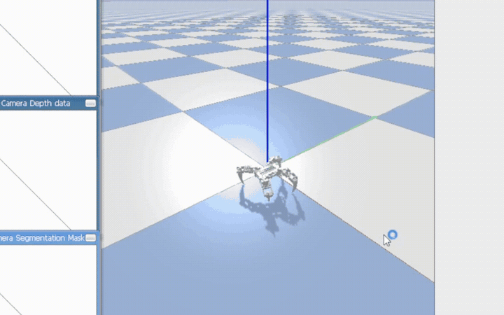

# SpiderBot: Manual Gait Controller (PyBullet)

A scripted crawl gait for a 12-DOF quadruped robot, simulated in PyBullet. Hold the UP arrow key and the robot walks forward.

This was the **manual fallback controller** for a 3-person engineering project (PFA, INSAT): if the team's reinforcement-learning policy failed to produce usable locomotion, this hand-written gait could still walk the robot. My part of the project was this controller.

## Demo




## The robot

Four legs, three joints each (hip swing, thigh, knee), 12 degrees of freedom in total. The physical build used an ESP32 with a PCA9685 PWM driver and 12 SG90 servos on a 5 V supply.

## How the gait works

The controller is a **10-state crawl cycle**. In a crawl, only one leg moves at a time, so three feet always stay on the ground. That's the slowest quadruped gait, but also the most stable, which is what you want from a fallback:

| States | What happens |
|---|---|
| 0-1 | Back-left leg lifts, swings forward, plants |
| 2-3 | Front-left leg lifts, swings forward, plants |
| 4 | First body push: left hips stroke backward, right hips reach forward, sliding the chassis forward |
| 5-6 | Back-right leg lifts, swings forward, plants |
| 7-8 | Front-right leg lifts, swings forward, plants |
| 9 | Second body push: all hips return to neutral, which drives the body forward again and restarts the cycle |

Two design details matter:

- **Offsets on top of a stance, not absolute angles.** Every joint has a neutral standing angle, and the gait only writes offsets relative to it. Retuning the robot's posture doesn't require rewriting the gait.
- **Smoothed interpolation.** Joints ease toward their target by 8% per simulation step instead of jumping. Step changes make the physics engine pop the robot into the air.

## The bug worth writing down

Early on, the robot would **lift off the ground** while walking instead of crawling forward.

The cause was that the target offsets were being rebuilt inside the main loop. Each leg therefore forgot its target the moment its state ended, so legs that should have been holding a planted position snapped back to neutral mid-stride. Four legs pushing against the ground at once threw the body upward.

The fix was to move `target_offsets` and `current_offsets` outside the loop so that a joint keeps its last commanded target until some state changes it, and to retune the state duration (from 100 to 25 simulation steps) so the cycle runs at a sensible cadence. After that the crawl was stable.

## Running it

The robot model is not duplicated here. Get it from the team's robot repository, [LansariFedi/SpiderBot](https://github.com/LansariFedi/SpiderBot), and copy its `urdf/` folder (the URDF file and its `meshes/`) next to `gait_controller.py`:

```
spiderbot-gait-controller/
├── gait_controller.py
└── urdf/
    ├── Spider_URDF.urdf
    └── meshes/
```

Then:

```bash
pip install -r requirements.txt
python gait_controller.py
```

Hold the UP arrow in the simulation window to walk; Ctrl+C to quit.

## Tuning

| Constant | Effect |
|---|---|
| `LIFT_J2` | How high a leg lifts. Too low and the foot drags; too high and the robot rocks. |
| `SWING_J1` | Stride length. |
| `TICKS_PER_STATE` | Cadence. Lower is faster, but too fast and legs move before the previous one has planted. |
| `SMOOTHING` | How sharply joints chase their targets. Higher is more responsive and more violent. |
| `LATERAL_FRICTION` | Ground grip. With low friction the feet slide and the gait goes nowhere. |

## Hardware status and what I'd change

The physical robot never walked. During testing, **7 of the 12 servos burned out**, and we ran out of time to rebuild before the deadline.

In hindsight the actuator choice was the problem: SG90s are plastic-geared micro servos rated for light loads, and under the chassis weight the ones carrying the body stalled, drew current continuously and overheated. The 5 V / 12 A supply had no trouble feeding them until they cooked.

What I would do differently:

- Use metal-geared servos sized for the actual load (MG996R class or better), chosen from a static torque estimate per joint rather than by what was in the parts box.
- Add current monitoring and a stall timeout that cuts drive when a joint stops moving under command.
- Test one leg at a time on the bench, holding the body in a jig, before running a full gait on the assembled robot.

## Project context and credits

Annual engineering project (PFA) at INSAT, 2026, by a team of three:

- **Faycal Toumi** (me): this manual gait controller in PyBullet.
- **Fedi Lansari** and **Yesser Hmidi**: the reinforcement-learning side, training a PPO locomotion policy in a custom PyBullet environment ([LansariFedi/SpiderBot](https://github.com/LansariFedi/SpiderBot)), plus additional simulation work in Gazebo.

The RL training code and the ESP32 firmware are not part of this repository.

**Licensing note:** the code here is MIT-licensed. The robot model (URDF and meshes) lives in the team repository under GPL-3.0 and is not redistributed here, which is why you download it separately rather than finding it in this repo.
